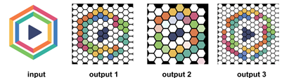
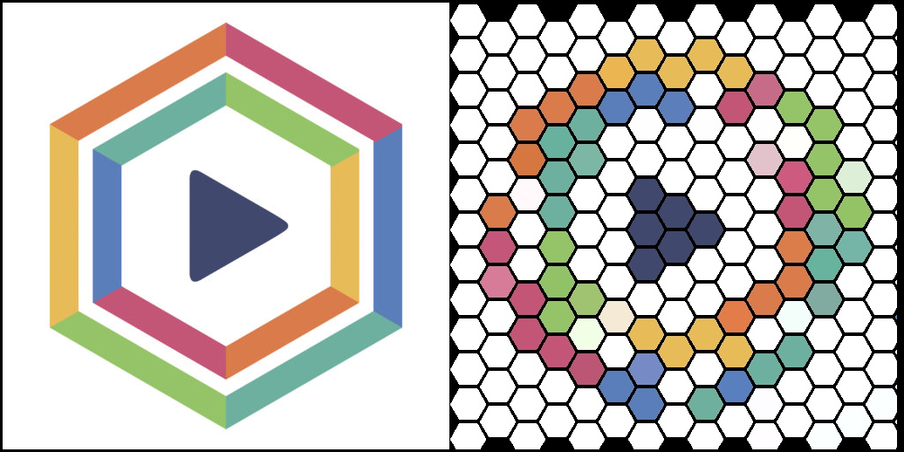
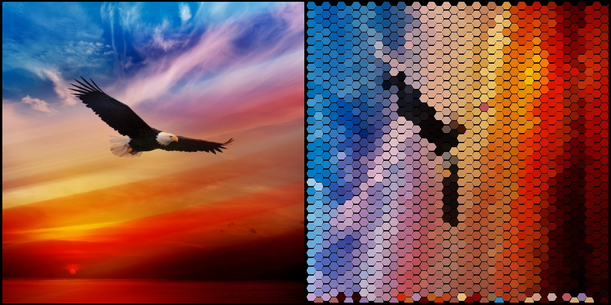
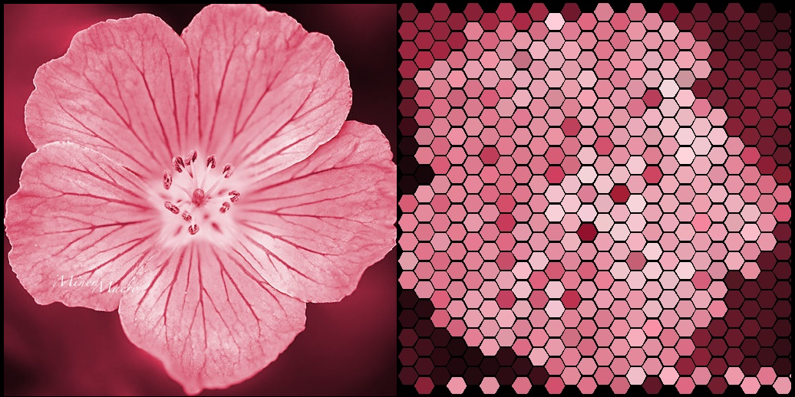
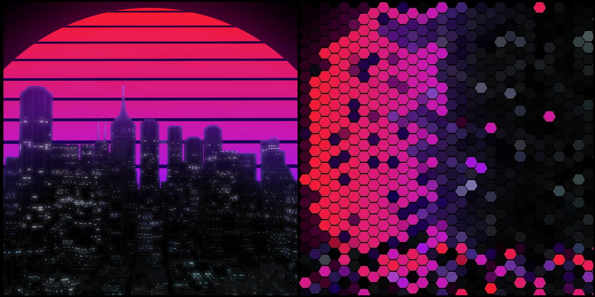

# Artificial Intelligence course: Genetic Algorithms
>Goal of algorithm create mosaic that is picture that consist of small elements (hexagon). To create an art Genetic Algorithm was used. Genetic algorithm works with chromosome. Chromosome is arrays of codes for colors for each hexagon on picture. Array of 100 chromosomes is a population. Genetic algorithm will perform selection, crossover and mutation on array of 100 chromosomes during one iteration until it will find population member that same as initial picture (according to fitness function).
## Demo

Example 1

Consider example 1. These results were obtained in 5000 generation. Output picture 1 was obtained with element size equals to 50. Output picture 2 was obtained with element size equal to 70. Output image consist of elements with size 40

Image 1 (left image is input picture and right image is output picture)

Image 2 (left image is input picture and right image is output picture)

Image 3 (left image is input picture and right image is output picture)

Image 4 (left image is input picture and right image is output picture)